# Gallstone Data Analysis Project

This project performs a comprehensive exploratory data analysis of medical data related to gallstones, including demographic variables, body composition measurements, and various health indicators.

## Data Dictionary

### Variables Description

| Variable Name | Role | Type | Demographic | Description | Units | Missing Values |
|--------------|------|------|-------------|-------------|-------|----------------|
| Gallstone Status | Target | Binary | | Target variable, Gallstones present(1), and absent(0) | | no |
| Age | Feature | Integer | Age | Age of the person | Years | no |
| Gender | Feature | Categorical | Gender | Gender of the person | | no |
| Comorbidity | Feature | Categorical | | Concomitant diseases | | no |
| Coronary Artery Disease (CAD) | Feature | Binary | | Cardiovascular disease | | no |
| Hypothyroidism | Feature | Binary | | Underactive thyroid gland | | no |
| Hyperlipidemia | Feature | Binary | | High levels of fat in the blood | | no |
| Diabetes Mellitus (DM) | Feature | Binary | | High blood sugar | | no |
| Height | Feature | Integer | | Height is the length | cm | no |
| Weight | Feature | Continuous | | Body weight | kg | no |
| BMI | Feature | Continuous | | Body Mass Index | kg/m² | no |
| Total Body Fat Ratio (TBFR) | Feature | Continuous | | Percentage of total body fat | % | no |
| Visceral Fat Rating (VFR) | Feature | Continuous | | Rating of fat around internal organs | | no |
| Total Cholesterol | Feature | Continuous | | Total cholesterol level | mg/dL | no |
| Glucose | Feature | Continuous | | Blood glucose level | mg/dL | no |
| Triglyceride | Feature | Continuous | | Triglyceride level | mg/dL | no |
| High Density Lipoprotein | Feature | Continuous | | HDL cholesterol level | mg/dL | no |
| Low Density Lipoprotein | Feature | Continuous | | LDL cholesterol level | mg/dL | no |
| Hepatic Fat Accumulation | Feature | Categorical | | Level of fat in the liver | Grade | no |

### Class Labels

- **Gallstone Status**: 0 (No), 1 (Yes)
- **Gender**: 0 (Male), 1 (Female)
- **Comorbidity**: 
  - 0 (No comorbidities present)
  - 1 (One comorbid condition)
  - 2 (Two comorbid conditions)
  - 3 (Three or more comorbid conditions)
- **Coronary Artery Disease**: 0 (No), 1 (Yes)
- **Hypothyroidism**: 0 (No), 1 (Yes)
- **Hyperlipidemia**: 0 (No), 1 (Yes)
- **Diabetes Mellitus**: 0 (No), 1 (Yes)
- **Hepatic Fat Accumulation (HFA)**:
  - 0 (No fat accumulation)
  - 1 (Grade 1 - mild)
  - 2 (Grade 2 - moderate)
  - 3 (Grade 3 - severe)
  - 4 (Grade 4 - very severe)

## Sample Data Examples (Feature Values by Gallstone Status)

### Demographic and Basic Metrics

| Gallstone | Age | Gender | Height | Weight | BMI |
|-----------|-----|--------|--------|--------|-----|
| 0         | 45  | 1      | 165    | 70.5   | 25.9|
| 0         | 38  | 1      | 160    | 58.7   | 22.9|
| 0         | 42  | 0      | 178    | 76.8   | 24.2|
| 1         | 62  | 0      | 175    | 82.3   | 26.9|
| 1         | 55  | 1      | 162    | 65.4   | 24.9|
| 1         | 58  | 1      | 159    | 68.2   | 27.0|

### Comorbidities

| Gallstone | Comorbidity | CAD | Hypothyroidism | Hyperlipidemia | DM |
|-----------|-------------|-----|----------------|----------------|-----|
| 0         | 1           | 0   | 0              | 1              | 0   |
| 0         | 0           | 0   | 0              | 0              | 0   |
| 0         | 0           | 0   | 0              | 0              | 0   |
| 1         | 2           | 1   | 0              | 1              | 1   |
| 1         | 1           | 0   | 1              | 1              | 0   |
| 1         | 2           | 1   | 1              | 1              | 1   |

### Metabolic Indicators

| Gallstone | Total Cholesterol | Glucose | Triglyceride | HDL  | LDL  | Hepatic Fat |
|-----------|-------------------|---------|--------------|------|------|-------------|
| 0         | 175               | 90      | 130          | 45   | 104  | 0           |
| 0         | 160               | 85      | 110          | 52   | 86   | 0           |
| 0         | 170               | 88      | 120          | 48   | 98   | 1           |
| 1         | 210               | 112     | 180          | 38   | 136  | 2           |
| 1         | 195               | 105     | 170          | 40   | 121  | 2           |
| 1         | 225               | 145     | 195          | 35   | 151  | 3           |

### Body Composition Metrics

| Gallstone | Total Body Fat Ratio (%) | Visceral Fat Rating | Muscle Mass | Body Water (%) |
|-----------|--------------------------|---------------------|-------------|----------------|
| 0         | 25.1                     | 8                   | 45.2        | 55.3           |
| 0         | 22.3                     | 6                   | 43.8        | 57.1           |
| 0         | 18.5                     | 7                   | 49.5        | 58.9           |
| 1         | 31.2                     | 13                  | 40.7        | 50.2           |
| 1         | 29.5                     | 11                  | 41.3        | 51.8           |
| 1         | 33.8                     | 14                  | 38.9        | 49.5           |

## Analysis Visualizations

The script generates several visualizations to help understand the relationships between variables:

### Basic Analysis

1. **Categorical Variables Analysis** (categorical_variables_analysis.png)
   - Shows the distribution of categorical variables (Gender, Comorbidity, CAD, etc.) in relation to Gallstone Status
   - Helps identify if certain conditions are more prevalent in patients with gallstones

2. **Demographic Variables Analysis** (demographic_variables_analysis.png)
   - Displays age distribution by gallstone status and gender
   - Helps understand if age is a significant factor in gallstone development
   - Shows gender-specific age patterns

3. **Body Composition Analysis** (body_composition_analysis.png)
   - Scatter plot of Height vs Weight by Gallstone Status
   - Box plot of Weight distribution by Gallstone Status
   - Helps identify if body composition metrics are related to gallstone presence

4. **Body Composition Correlations** (body_composition_correlation.png)
   - Heat map showing correlations between body composition variables
   - Helps understand relationships between Height, Weight, and Age

5. **General Correlation Matrix** (general_correlation_matrix.png)
   - Comprehensive correlation analysis between all numeric variables
   - Helps identify potential relationships between different health indicators
   - Improved visualization with better readability and color mapping

### Advanced Analysis

6. **BMI vs Age Analysis** (bmi_vs_age.png, bmi_by_age_group.png)
   - Examines the relationship between BMI and age with gallstone status
   - Shows age-group specific BMI patterns and their association with gallstones
   - Includes trend lines to visualize relationships

7. **Height vs Weight by Gender** (height_vs_weight_by_gender.png)
   - Analyzes how height and weight relationships differ by gender
   - Reveals gender-specific body composition patterns related to gallstones

8. **Age by Gallstone and Gender** (age_by_gallstone_and_gender.png)
   - Examines age distributions by both gallstone status and gender
   - Provides insight into whether age of gallstone appearance differs by gender

9. **Clinical Variables Analysis** (clinical_variables_correlation.png, clinical_variables_pairplot.png)
   - Explores correlations between clinical markers like cholesterol, glucose, triglycerides
   - Pairwise plots to visualize relationships between key clinical indicators
   - Helps identify potential biomarkers for gallstone development

10. **Comorbidity Prevalence** (comorbidity_prevalence.png)
    - Analyzes the prevalence of different comorbidities in gallstone patients
    - Includes statistical tests to determine significant associations
    - Provides percentage breakdowns of each condition

11. **Visceral Fat Analysis** (visceral_fat_by_gallstone.png)
    - Examines the relationship between visceral fat and gallstone presence
    - Statistical analysis to determine significance of the relationship
    - Compares visceral fat distributions between patients with and without gallstones

## Generated Visualizations

Below are examples of the visualizations generated by the analysis:

### Basic Analysis Outputs

**Categorical Variables Analysis**
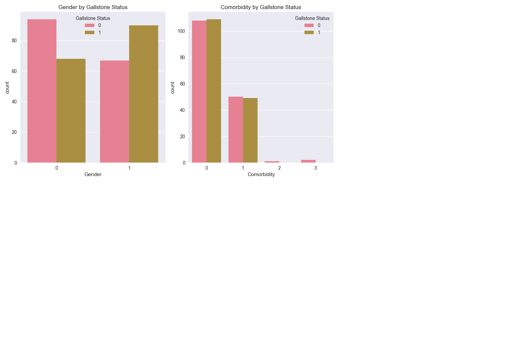

**Demographic Variables Analysis**
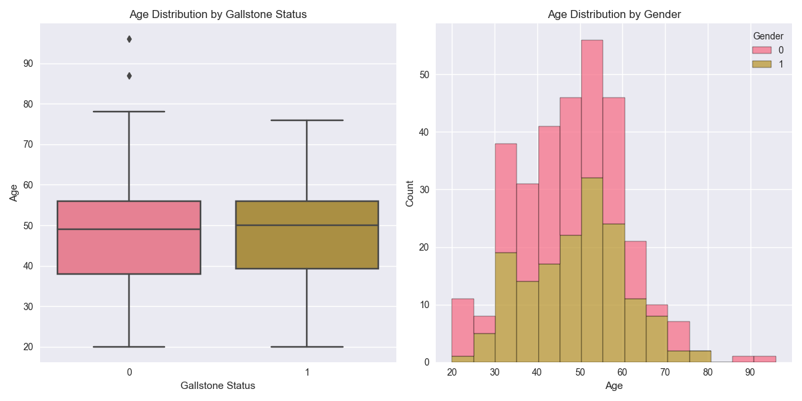

**Body Composition Analysis**
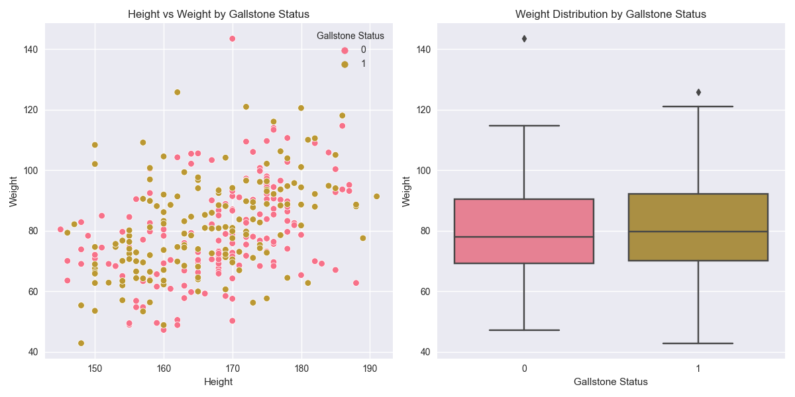

**Body Composition Correlations**
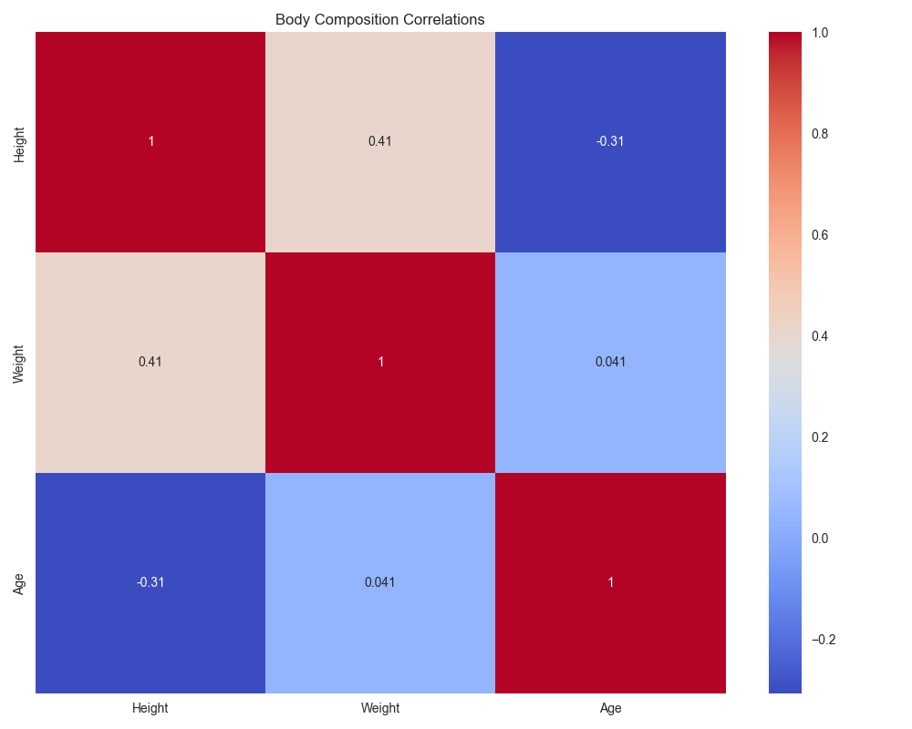

**General Correlation Matrix**
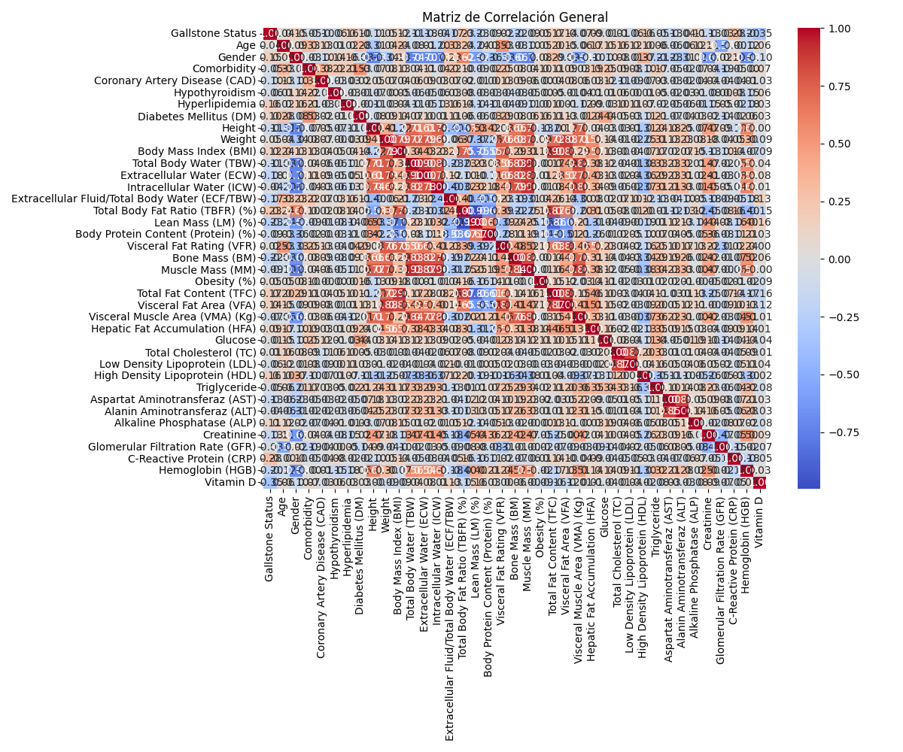

### Advanced Analysis Outputs

**BMI vs Age Analysis**
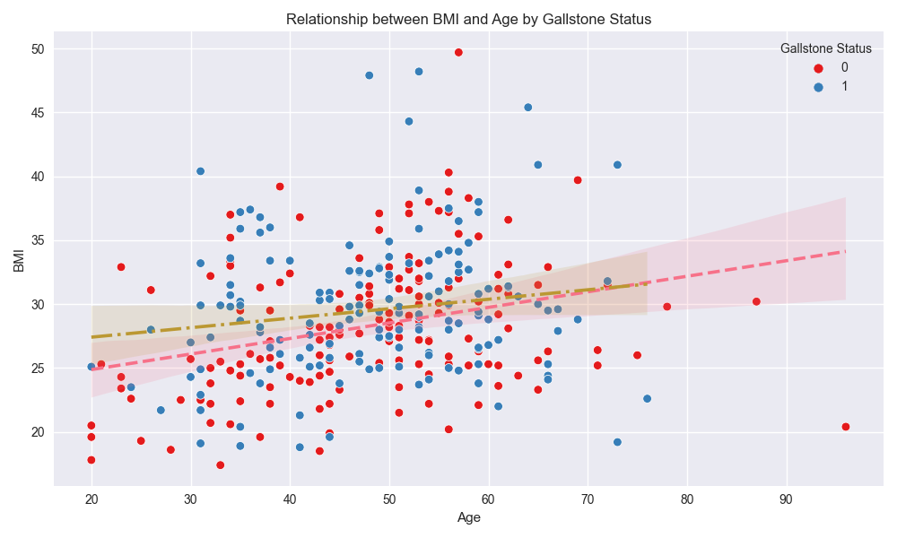

**BMI by Age Group**
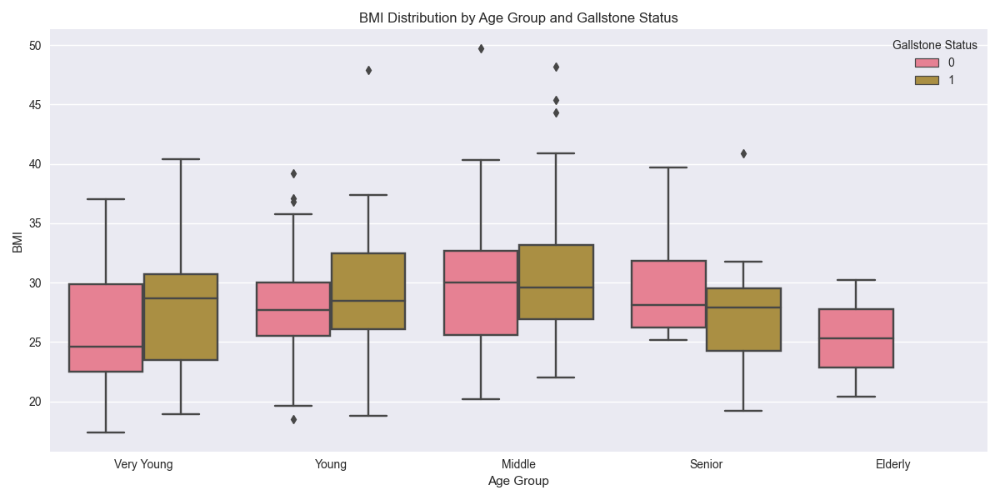

**Height vs Weight by Gender**
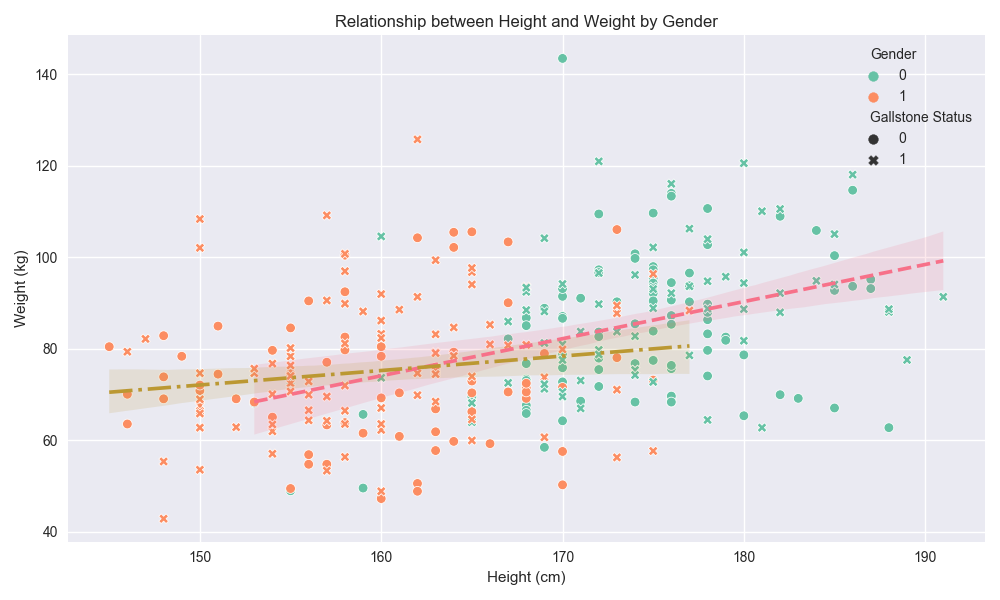

**Age by Gallstone and Gender**
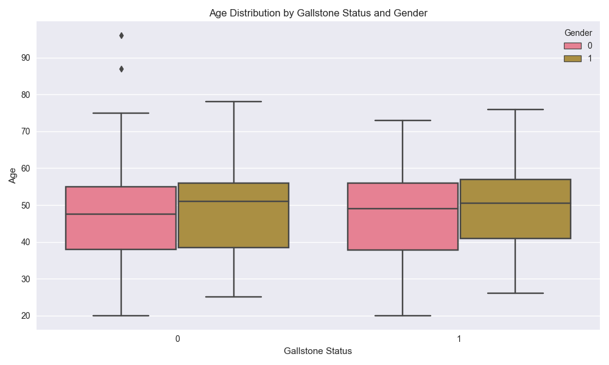

**Clinical Variables Correlation**
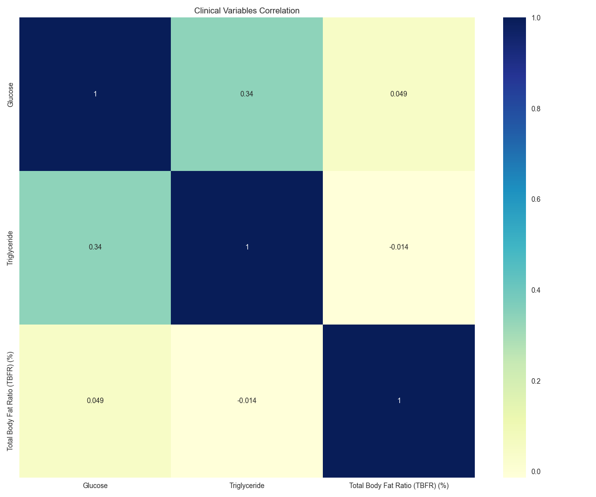

**Clinical Variables Pairplot**
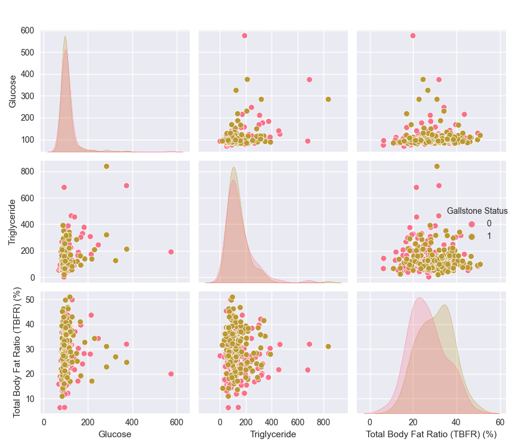

**Comorbidity Prevalence**
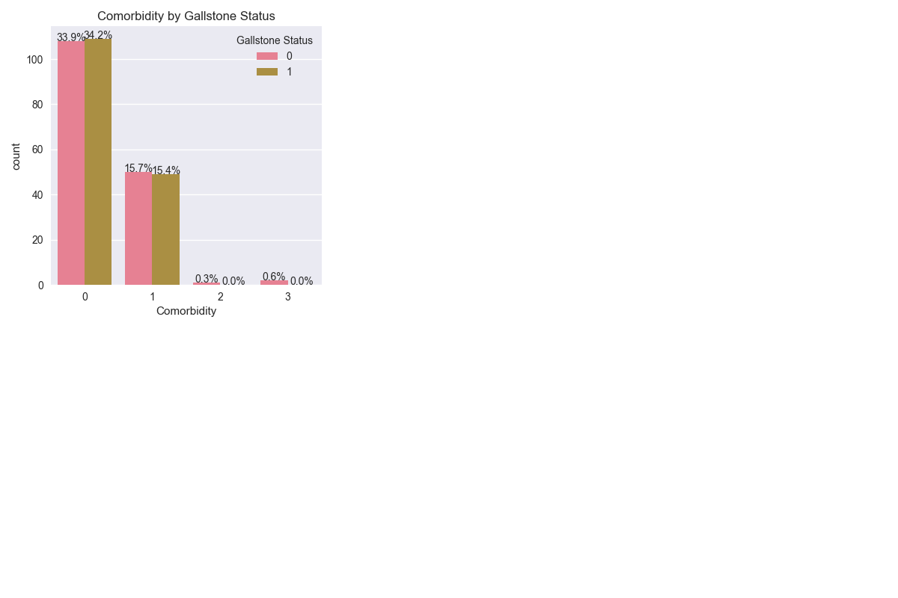

**Visceral Fat Analysis**
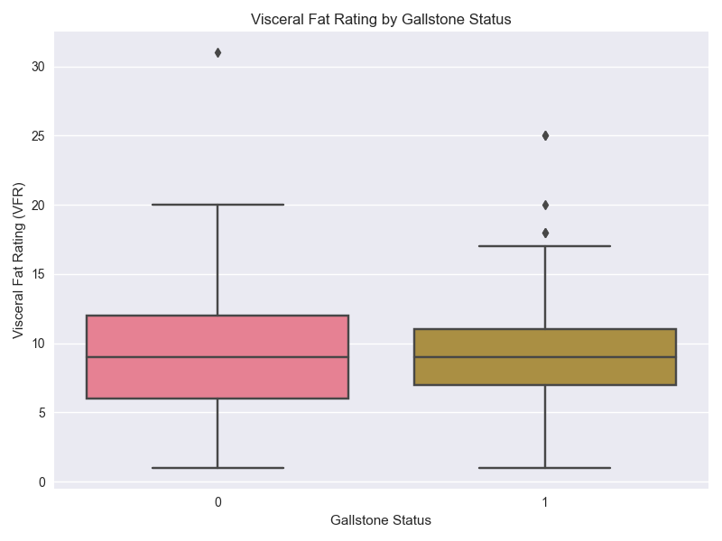

**Example of Variable Distribution**
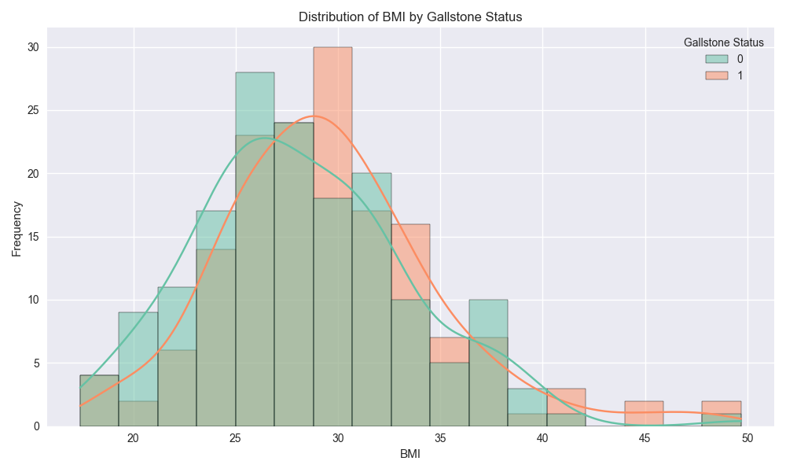

## Requirements

- Python 3.7 or higher
- Required packages:
  - pandas
  - numpy
  - matplotlib
  - seaborn
  - scipy (for statistical tests)

## Installation

1. Clone this repository or download the files
2. Install the dependencies:
```bash
pip install pandas numpy matplotlib seaborn scipy
```

## Usage

1. Ensure the `dataset-uci.xlsx` file is in the same directory as the script
2. Run the script:
```bash
python analyze_gallstone_data.py
```

The script will generate all visualizations and provide a detailed analysis of the data in the console output. The analysis includes statistical tests, correlation analysis, and visualizations to help understand the patterns and relationships in the data.

## Key Findings

From the analysis, several patterns emerge that may be relevant to understanding gallstone development:

- Patients with gallstones tend to have higher BMI, especially as age increases
- There are gender-specific patterns in gallstone prevalence, with differences in age of occurrence
- Metabolic factors like high triglycerides, cholesterol, and glucose levels show correlations with gallstone presence
- Visceral fat appears to be more strongly associated with gallstones than overall body fat percentage
- Comorbidities like hyperlipidemia and diabetes show significant associations with gallstone development

These findings highlight the multifactorial nature of gallstone disease and suggest potential avenues for preventive interventions. 